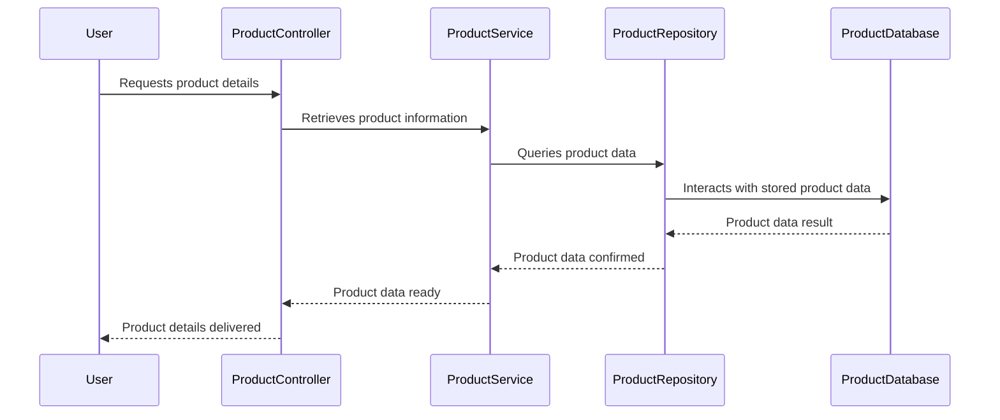

# Ecommerce Application

# Table of Contents
1.  [Module Overview](#1-module-overview)
2.  [How to Run the Program](#2-how-to-run-the-program)
3.  [Component Diagram](#3-component-diagram)
4.  [Sequence Diagram](#4-sequence-diagram)
5.  [Layered architecture](#5-layered-architecture)
6.  [Database Table](#6-database-table)
7.  [Endpoints](#7-endpoints)
8.  [File Structure](#8-file-structure)

---

# Ecommerce Application

### 1. Module Overview

The Product Module is a Spring Boot-based RESTful web service designed to manage products within an e-commerce platform. It provides endpoints for standard CRUD (Create, Read, Update, Delete) operations on product entities. This module integrates with a Eureka Discovery Service for its own service registration and for discovering other necessary services. It utilizes MySQL as its persistent data store and adheres to a layered architecture for enhanced maintainability and scalability.

### 2. How to Run the Program

2.1.  **Clone the Repository**

    Run the following command to build the project:
    ```bash
    git clone [https://github.com/Santhoshram7077/E-Commerce.git](https://github.com/Santhoshram7077/E-Commerce.git)
    ```
2.2.  **Build the Project**

    Run the following command to build the project:
    ```bash
    mvn clean install
    ```
2.3.  **Run the Application Locally**

    Execute the following command to start the service locally:
    ```bash
    mvn spring-boot:run
    ```

### 3. Component Diagram

The diagram depicts the high-level structural breakdown of the Product service, highlighting its layers and external connections.

```mermaid
graph TD
    B[User Controller] --> C[User Service]
    C --> D[User Repository]
    D --> E[User Database]
    B -- Registers and Discovers --> F[Eureka Discovery Service]

### 1. Module Overview

The Product Module is a Spring Boot-based RESTful web service designed to manage products within an e-commerce platform. It provides endpoints for standard CRUD (Create, Read, Update, Delete) operations on product entities. This module integrates with a Eureka Discovery Service for its own service registration and for discovering other necessary services. It utilizes MySQL as its persistent data store and adheres to a layered architecture for enhanced maintainability and scalability.

### 2. How to Run the Program

1. **Clone the Repository**
   
   Run the following command to build the project:
   ```bash
   git clone https://github.com/Santhoshram7077/E-Commerce.git
   ```
2. **Build the Project**
   
    Run the following command to build the project:  
    ```bash
    mvn clean install
    ```
 3. **Run the Application Locally**
    
    Execute the following command to start the service locally:  
    ```bash
    mvn spring-boot:run
    ```

### 3. Component Diagram

The diagram depicts the high-level structural breakdown of the Product service, highlighting its layers and external connections.

```mermaid
graph TD
    B[User Controller] --> C[User Service]
    C --> D[User Repository]
    D --> E[User Database]
    B -- Registers and Discovers --> F[Eureka Discovery Service]
```
### 4. Sequence Diagram



### 5. Layered architecture

The project follows a **layered architecture**:

* **Controller Layer:** Handles HTTP requests and responses.
* **Service Layer:** Contains business logic and interacts with the repository layer.
* **Repository Layer:** Manages database operations using Spring Data JPA.
* **Model Layer:** Defines the data structure for the application.

#### Key Features:

* **Spring Boot:** Simplifies application setup and development.
* **Spring Data JPA:** Provides easy integration with the MySQL database.
* **Eureka Client:** Registers the service with a Eureka Discovery Server.
* **RESTful Endpoints:** Exposes endpoints for managing products.
* **Swagger/OpenAPI:** Provides API documentation using SpringDoc.

### 6. Database Table

The application uses a single table, `Product`, in the MySQL database. The table structure is as follows:

| Column Name | Data Type | Description                   |
| :---------- | :-------- | :---------------------------- |
| `productId` | `BIGINT`  | Primary key, auto-generated.  |
| `name`      | `VARCHAR` | Name of the product.          |
| `description` | `VARCHAR` | Description of the product.   |
| `price`     | `DOUBLE`  | Price of the product.         |
| `category`  | `VARCHAR` | Category of the product.      |
| `imageURL`  | `VARCHAR` | URL of the product image.     |
| `quantity`  | `INT`     | Quantity available.           |

### 7. Endpoints

The application exposes the following RESTful endpoints for managing products:

**Base URL:** `http://localhost:8087/api/products`

#### 1. Get All Products

* **Endpoint:** `GET /api/products`
* **Description:** Retrieves a list of all products.
* **Controller Method:** `ProductController.getAllProducts()`

#### 2. Get Product by ID

* **Endpoint:** `GET /api/products/{id}`
* **Description:** Retrieves a product by its ID.
* **Controller Method:** `ProductController.getProductById(Long id)`

#### 3. Create a New Product

* **Endpoint:** `POST /api/products`
* **Description:** Creates a new product.
* **Request Body:**

    ```json
    {
      "name": "Product Name",
      "description": "Product Description",
      "price": 100.0,
      "category": "Category Name",
      "imageURL": "[http://example.com/image.jpg](http://example.com/image.jpg)",
      "quantity": 10
    }
    ```
* **Controller Method:** `ProductController.createProduct(Product product)`

#### 4. Update an Existing Product

* **Endpoint:** `PUT /api/products/{id}`
* **Description:** Updates an existing product by its ID.
* **Request Body:**

    ```json
    {
      "name": "Updated Name",
      "description": "Updated Description",
      "price": 120.0,
      "category": "Updated Category",
      "imageURL": "[http://example.com/updated-image.jpg](http://example.com/updated-image.jpg)",
      "quantity": 15
    }
    ```
* **Controller Method:** `ProductController.updateProduct(Long id, Product product)`

#### 5. Delete a Product

* **Endpoint:** `DELETE /api/products/{id}`
* **Description:** Deletes a product by its ID.
* **Controller Method:** `ProductController.deleteProduct(Long id)`

### 8. File Structure

```
ecommerce/
├── src/
│   ├── main/
│       ├── java/
│       │   └── com.example.ecommerce/
│       │       ├── controller/       # REST Controllers
│       │       ├── model/            # Entity Classes
│       │       ├── repository/       # JPA Repositories
│       │       └── service/          # Business Logic
│       └── resources/
│           ├── application.properties # Configuration
│           ├── static/               # Static Resources
│           └── templates/            # Templates 
├── pom.xml                            # Maven Configuration
└── README.md
```
